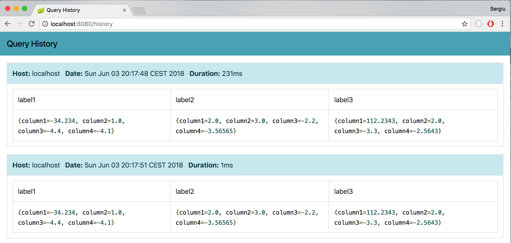

# SpringBoot Median Calculation Web Service

Web service which accepts the csv parsed data and calculates the median value 
for each column, grouped by the 'label' column

### Running

```shell
./gradlew bootRun
```

Endpoint is available at `http://localhost:8080/median`

### Inspect past queries

`http://localhost:8080/history`

[](doc/history-main.png)


###

